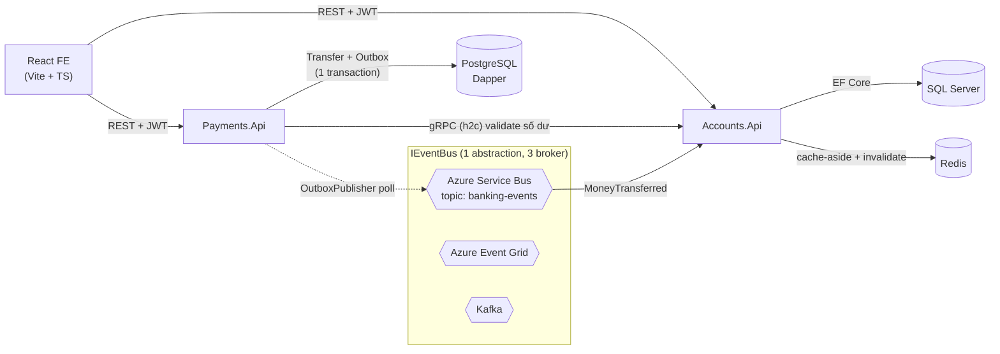
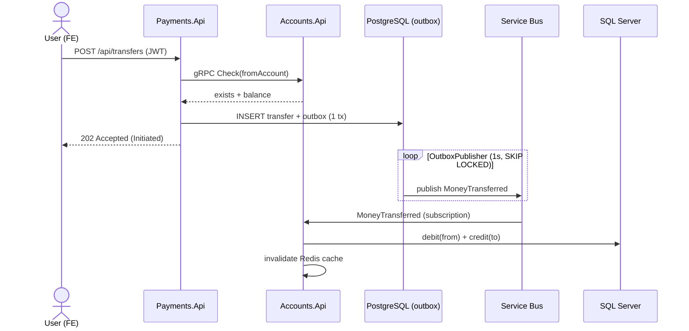

# Architecture — banking-domain

Microservices .NET 9 event-driven, database-per-service, messaging trừu tượng hoá (Service Bus /
Event Grid / Kafka), Outbox pattern, gRPC sync, JWT, Redis cache, React frontend.

## Component diagram

## Money transfer — sequence

## Nguyên tắc thiết kế

| Vấn đề | Giải pháp |
|--------|-----------|
| Không mất event khi DB commit nhưng broker lỗi | **Outbox pattern** (persist + outbox 1 transaction → publisher → at-least-once) |
| Đổi message broker không sửa domain | **IEventBus** abstraction — Service Bus / Event Grid / Kafka qua `Messaging:Provider` |
| Consistency giữa 2 service | Eventual consistency + idempotent consumer (MessageId), dead-letter theo MaxDeliveryCount |
| Dependency chưa ready khi startup | Retry connection có backoff (portable, chạy cả k8s) |
| Multi-instance publisher | `FOR UPDATE SKIP LOCKED` trên outbox |
| Data modeling vs query optimization | EF Core (Accounts/SQL Server) + Dapper raw SQL (Payments/PostgreSQL) |

## Layers (Clean Architecture, mỗi service)
`Domain` (aggregate, không phụ thuộc) → `Application` (use case, interface) → `Infrastructure`
(EF/Dapper, Outbox, consumer, gRPC) → `Api` (Minimal API + gRPC). Shared: `BuildingBlocks` (IEventBus, contracts).
