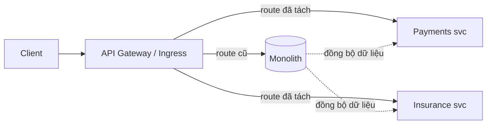

# Từ monolith sang microservices — cách tiếp cận

JD có nhắc *"Experience migrating monolithic systems to microservices"*. Tài liệu này ghi lại cách
tiếp cận đã dùng và lý do các quyết định — repo này chính là **đích đến** của quá trình đó, còn
[D-Pro](https://github.com/daochinam1081406/D-Pro) là **điểm xuất phát** (composable monolith 23 module).

## 1. Vì sao KHÔNG tách microservices ngay từ đầu

D-Pro cố ý là **composable monolith**: 23 bounded context trong 1 process, giao tiếp qua in-process
handler + Kafka. Lý do:

- Ranh giới nghiệp vụ **chưa ổn định** — tách sớm = phải sửa hợp đồng liên service mỗi lần đổi domain.
- Team nhỏ: chi phí vận hành N service (deploy, trace, versioning) lớn hơn lợi ích.
- Monolith có **module rõ ràng** vẫn tách được sau, còn monolith rối thì tách kiểu gì cũng khổ.

> Nguyên tắc: **modularize trước, distribute sau**. Microservices là quyết định *vận hành*
> (scale/deploy độc lập), không phải quyết định *chất lượng code*.

## 2. Khi nào mới tách

Tách khi có ít nhất một trong các tín hiệu:

| Tín hiệu | Ví dụ |
|---|---|
| Nhịp thay đổi khác nhau | Claims đổi hàng tuần, Policy đổi hàng quý |
| Nhu cầu scale khác nhau | Chi trả cao điểm cuối tháng, hợp đồng đều đều |
| Ranh giới team | Team bảo hiểm ≠ team ngân hàng lõi |
| Ràng buộc tuân thủ | Dữ liệu thanh toán cần cách ly (PCI) |
| Công nghệ khác nhau | Bên cần SQL Server, bên cần PostgreSQL |

## 3. Chiến lược: Strangler Fig

Không "big bang rewrite". Bọc dần từng phần, monolith teo lại theo thời gian.

**Các bước đã áp dụng trong repo này:**

1. **Tách theo bounded context, không theo tầng kỹ thuật.** Cắt "Payments" (trọn vẹn domain + data +
   API), không cắt kiểu "tách tầng data ra service riêng" — cắt ngang tầng chỉ tạo distributed monolith.
2. **Database-per-service.** Bước khó nhất. Accounts → SQL Server, Payments/Insurance → PostgreSQL.
   Hết JOIN xuyên service ⇒ buộc phải thiết kế lại bằng event/API.
3. **Thay JOIN bằng event.** Trước: `JOIN` bảng account để lấy số dư. Sau: gRPC `AccountCheck` (đọc
   đồng bộ) + `MoneyTransferred` (cập nhật bất đồng bộ).
4. **Outbox pattern** để không mất event khi bỏ transaction chung.
5. **Saga thay cho distributed transaction.** `ClaimApproved → chi trả → ClaimPaid`, có compensating
   event khi thất bại — chấp nhận eventual consistency.
6. **Correlation ID + structured log** ngay từ đầu, nếu không sẽ mù khi debug.

## 4. Cái gì KHÔNG nên tách

- **Auth**: giữ tập trung (ở đây Payments phát JWT, service khác chỉ validate) — tách sớm là tự làm khổ.
- **Bảng tra cứu dùng chung** (mã tiền tệ, mã tỉnh): sao chép/cache, đừng dựng service riêng.
- **Thực thể có ràng buộc chặt trong 1 transaction**: nếu buộc phải atomic thì nên ở chung service.
  Ví dụ `Claim` và hạn mức `Policy` — cùng service Insurance, cùng transaction; nếu tách sẽ phải saga
  cho một thứ vốn dĩ nên nguyên tử.

## 5. Cái giá phải trả (nói thẳng)

| Được | Mất |
|---|---|
| Deploy/scale độc lập | Eventual consistency — không còn `SELECT ... JOIN` |
| Cách ly lỗi | Debug khó gấp nhiều lần (bắt buộc correlation ID + tracing) |
| Tự do chọn công nghệ per service | Hạ tầng nhiều hơn: broker, service discovery, k8s |
| Ranh giới team rõ | Versioning hợp đồng liên service |

## 6. Bài học từ chính repo này

Những lỗi **thật** đã gặp khi tách (đều đã fix, xem git history):

- **Consumer không idempotent** — broker at-least-once ⇒ trừ tiền 2 lần. Phải có inbox/dedup.
- **Dùng chung subscription cho 2 luồng** ⇒ competing consumers, message bị consumer khác nuốt.
- **Concurrency token khác nhau theo DB** — SQL Server `rowversion` vs PostgreSQL `xmin`.
- **Event mang sai số tiền** — publish chi phí công nhận thay vì số thực trả ⇒ chi thừa tiền.
- **Startup race** — container start ≠ DB ready ⇒ cần retry.

> Đây chính là loại rủi ro mà monolith không có. Tách microservices là **đánh đổi**, không phải nâng cấp.
